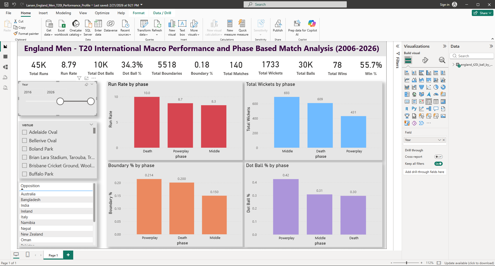
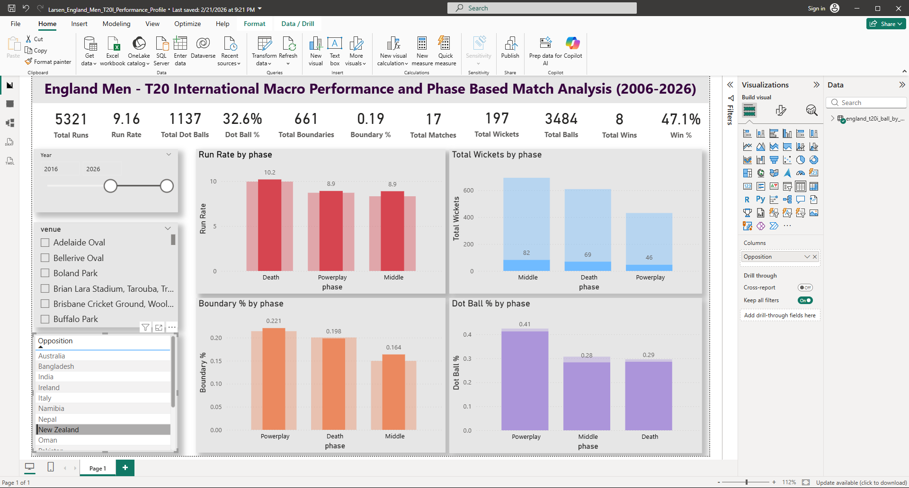
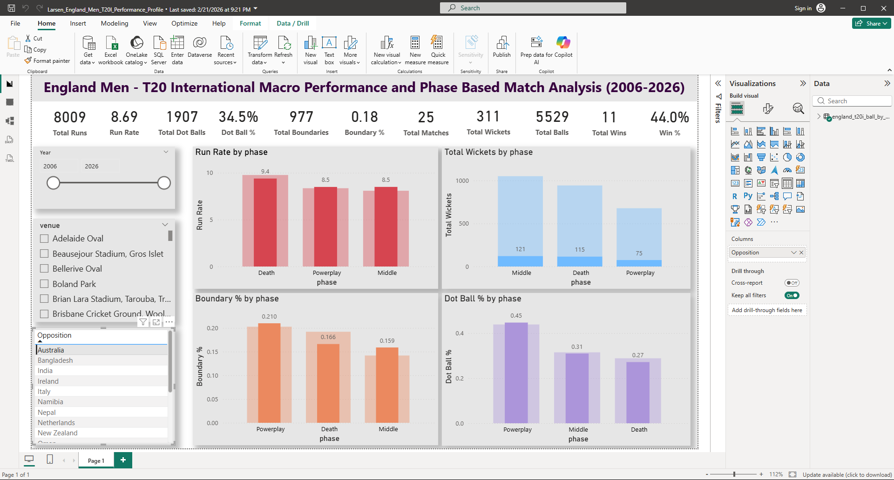
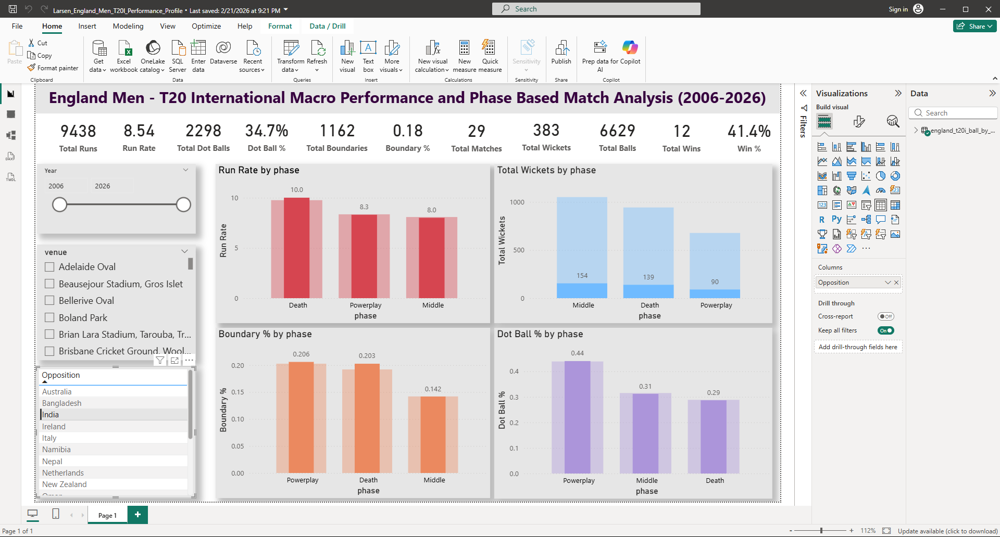

# Interactive Performance Dashboard – England Men's T20 Cricket Dataset

Interactive Power BI dashboard analysing England Men's T20 International cricket performance data across multiple seasons, with Python-based data preparation.

---

## Overview

This project combines Python for data cleaning and preparation with Power BI for interactive visualisation. The dashboard enables self-service data exploration, allowing non-technical stakeholders to explore performance trends through filters, slicers and KPI cards without requiring technical support.

---

## Tech Stack

| Tool | Purpose |
|------|---------|
| Python | Data cleaning, structuring and integration |
| Pandas | Dataset manipulation and pre-processing |
| Power BI | Interactive dashboard and visualisation |
| DAX | Calculated measures and KPI logic |
| Excel / CSV | Data source format |

---

## Project Workflow

### 1. Data Preparation (Python)
- Cleaned and structured raw T20 match datasets using Pandas
- Resolved inconsistencies, handled missing values and standardised formats
- Integrated data from multiple sources to create a unified, analysis-ready dataset
- Exported clean data for import into Power BI

### 2. Dashboard Design (Power BI)
- Designed a multi-page interactive dashboard focused on key performance indicators
- Built KPI cards tracking strike rates, scoring trends and match outcomes
- Created visualisations including bar charts, line graphs and performance heatmaps

### 3. Interactivity & Self-Service Analytics
- Implemented interactive filters and slicers enabling dynamic data exploration
- Enabled cross-filtering across visuals for drill-down analysis
- Designed the layout for accessibility by non-technical stakeholders

### 4. Trend Analysis
- Built trend analysis visuals to track performance changes across seasons
- Highlighted high-impact match variables using conditional formatting and visual cues

---

## Key Features

- **KPI Cards** – Strike rate, run rate, wickets and match outcomes at a glance
- **Trend Analysis** – Season-on-season performance comparisons
- **Interactive Filters** – Filter by player, venue, opposition and date range
- **Drill-through Pages** – Detailed breakdowns per match and per player
- **Non-technical Friendly** – Clean layout designed for stakeholder self-service

---

## Repository Structure

```
t20-cricket-power-bi-dashboard/
│
├── data/                   # Cleaned datasets (CSV)
├── scripts/                # Python pre-processing scripts
│   └── data_prep.py
├── dashboard/              # Power BI file (.pbix)
│   └── t20_dashboard.pbix
├── screenshots/            # Dashboard preview images
├── requirements.txt        # Python dependencies
└── README.md
```

---

## Dashboard Preview






---

## How to Run

```bash
# Clone the repository
git clone https://github.com/larsen-analyst/t20-cricket-power-bi-dashboard.git

# Install Python dependencies
pip install -r requirements.txt

# Run data preparation
python scripts/data_prep.py

# Open the dashboard
# Open dashboard/t20_dashboard.pbix in Power BI Desktop
```

---

## Skills Demonstrated

`Power BI` `Python` `Pandas` `Data Visualisation` `KPI Reporting` `DAX` `Data Cleaning` `Data Integration` `Dashboard Development` `Self-Service Analytics` `Stakeholder Reporting`

---

## Author

**Larsen Peter Anandh**  
MSc Student – Performance Analysis and Applied Data Analytics, University of Essex  
[LinkedIn](https://www.linkedin.com/in/analystlarsen) | [GitHub](https://github.com/larsen-analyst)
